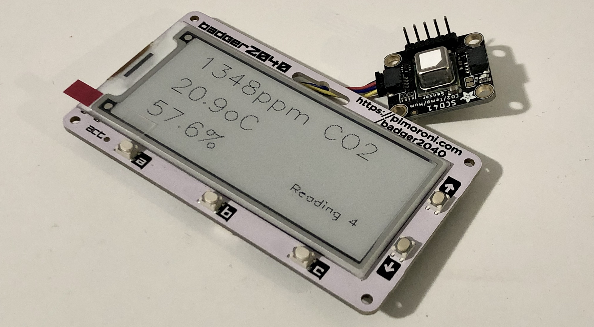

# Badger 2040 CO2 monitor

A CO2 monitor that prints readings to a Pimoroni Badger 2040 e-ink display.

When powered up (or the `a` + `c` buttons are pressed), the sensor will make 10 readings and display them on screen.

After the 10th reading it will shutdown to save power, leaving the last reading on the screen.

## Software

To upload the monitor to the Badger 2040 running Micropython, install [Adafruit ampy](https://pypi.org/project/adafruit-ampy/).

* Plug your Badger 2040 into your laptop via USB
* Upload the software: `ampy --port /dev/tty.usbmodem14401 --baud 115200 put main.py`
* Unplug your Badger 2040 and re-plug it in
* You should see the display start up
* You can monitor it over USB using: `screen /dev/tty.usbmodem14401 115200 -L`

## Useful links

* [Badger 2040 getting started guide](https://learn.pimoroni.com/article/getting-started-with-badger-2040)
* [Badger 2040 functions](https://github.com/pimoroni/pimoroni-pico/tree/main/micropython/modules/badger2040#update-speed)

## TODO

- [x] Display readings from an SCD-41 CO2 sensor
- [ ] Display readings from an SCD-30 CO2 sensor
- [ ] Display maximum/average readings
- [ ] Graph the readings over time
